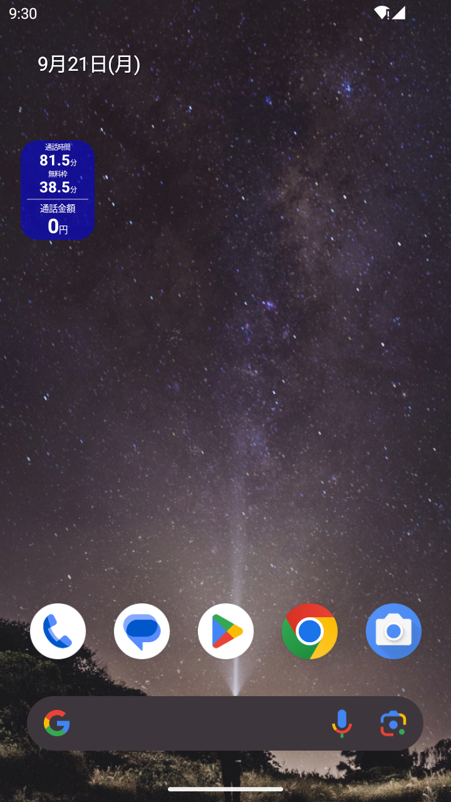
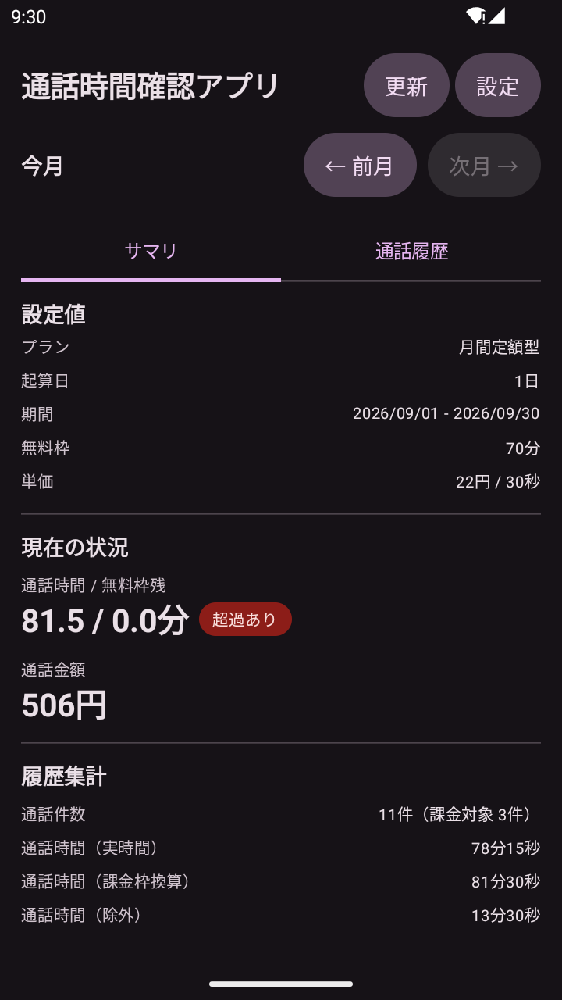
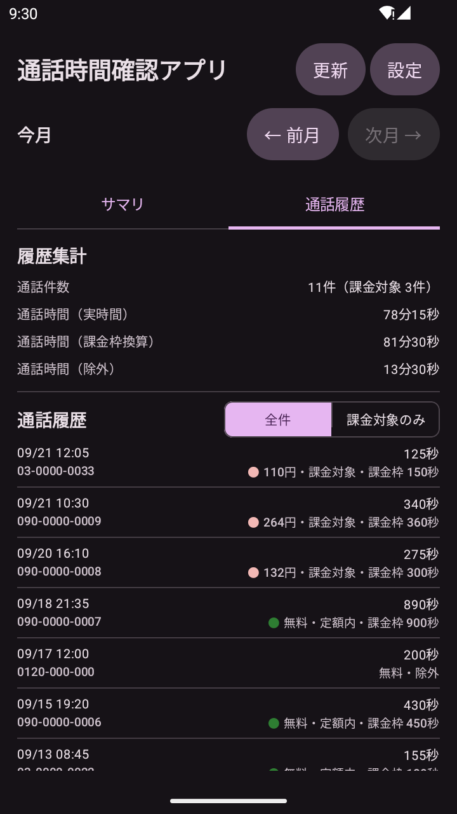
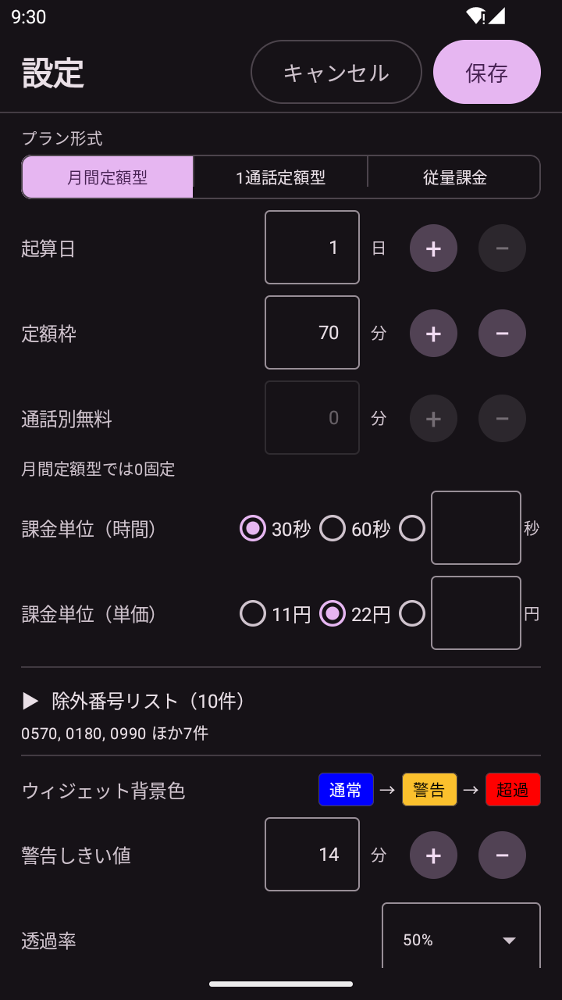

# 通話時間確認アプリ

契約中の音声通話プランについて、積算通話時間と概算通話料金をホーム画面ウィジェットに常時表示する Android アプリです。

## スクリーンショット

| ホーム画面のウィジェット | サマリ |
|:---:|:---:|
|  |  |
| 1x1 のウィジェット。使用量に応じて通常色・警告色・超過色に切り替わる | 当月の通話時間・無料枠残・通話金額と設定値 |
| **通話履歴** | **設定** |
|  |  |
| 1 件ごとの判定（定額内 / 課金対象 / 除外）と課金枠の消費秒数 | プラン形式・起算日・定額枠・課金単位などを設定 |

※ エミュレータ上のダミー通話データによる画面です（実在の電話番号は含みません）。

## 主な機能

### 3 種のプラン形式に対応

| プラン形式 | 想定する契約 |
|---|---|
| 月間定額型 | 月あたりの無料通話枠がある（例: 月 70 分まで無料） |
| 1 通話定額型 | 1 通話あたり一定時間まで無料（例: 1 回 5 分まで無料） |
| 従量課金 | 無料枠なし。通話時間に応じて課金 |

課金単位と単位金額を設定でき、通話ごとに単位へ切り上げてから枠を消費・課金する実際の計算方式に沿って集計します。

### ホーム画面ウィジェット

- 上段に通話時間（月間定額型はさらに無料枠の残り）、下段に通話金額
- 使用量に応じて背景色が **通常色 → 警告色 → 超過色** と切り替わる
- 30 分ごとの自動更新に加え、タップでその場で手動更新
- 直近の更新が自動更新だった場合は「通話金額」の横に ↻ が付き、タップ時点の数字か周期更新後の数字かを見分けられる
- 1x1 を基本サイズとし、縦方向に 1x2 まで拡大可能

### 設定のカスタマイズ

- 契約の起算日（1〜31 日）に合わせた集計期間
- 定額枠 / 通話別無料時間 / 課金単位 / 単位金額
- 警告色に切り替わる残り時間のしきい値
- 除外番号リスト（ナビダイヤル `0570`、フリーダイヤル `0120`、`110` / `119` などを初期値として同梱。編集可）

### 月別の履歴閲覧

- 「サマリ」「通話履歴」の 2 タブ構成
- 「← 前月」「次月 →」で過去の集計期間をさかのぼって確認
- 通話履歴タブでは 1 件ごとに日時・番号・通話時間・判定結果と課金枠の消費秒数を表示。「全件 / 課金対象のみ」で絞り込み可

生ログをそのまま保存し、判定と課金計算は表示のたびに行う設計なので、**設定を変えると過去分もその場で計算し直されます**。

## 動作環境

| 項目 | 内容 |
|---|---|
| 対応 OS | Android 8.0（API 26）以降 |
| targetSdk | 37 |
| 必要な権限 | `READ_CALL_LOG`（通話履歴の読み取り） |
| ネットワーク | 不要（通信は一切行いません） |
| 想定 SIM 構成 | シングル SIM |
| 想定発信手段 | 標準の電話アプリ |

## インストール

**このアプリは Google Play では配布していません。**

1. [Releases](https://github.com/eightbrows/CallTimeChecker/releases) から最新の `calltimechecker-*.apk` をダウンロードする
2. 端末の「提供元不明のアプリ」/「不明なアプリのインストール」を、ダウンロードに使ったブラウザ等に対して許可する
3. APK を開いてインストールする
4. アプリを起動し、**通話履歴の読み取り権限（`READ_CALL_LOG`）を許可する**
5. 設定画面で契約内容（起算日・定額枠・単価など）を入力する
6. ホーム画面にウィジェットを配置する

## 注意事項

- 表示される金額はあくまで概算です
- 着信は対象外です
- IP 電話 / VoIP アプリの通話は集計できません
- 複数 SIM の個別集計には対応していません

## ライセンス

[Apache License 2.0](LICENSE) のもとで公開しています。

